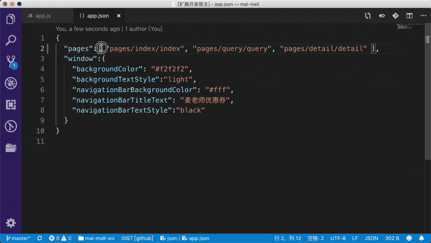

# Object & Array Formatter

Toggles Selected Object Or Array Between Multi-line & Single-line.

**warning:**

## Features

## How To Use

1. Open Command Pallette & Type `Object Array Formatter`
2. Alternatively, Use Hot Key: `ctrl + cmd + s` in Mac or `ctrl + alt + s` in Win
