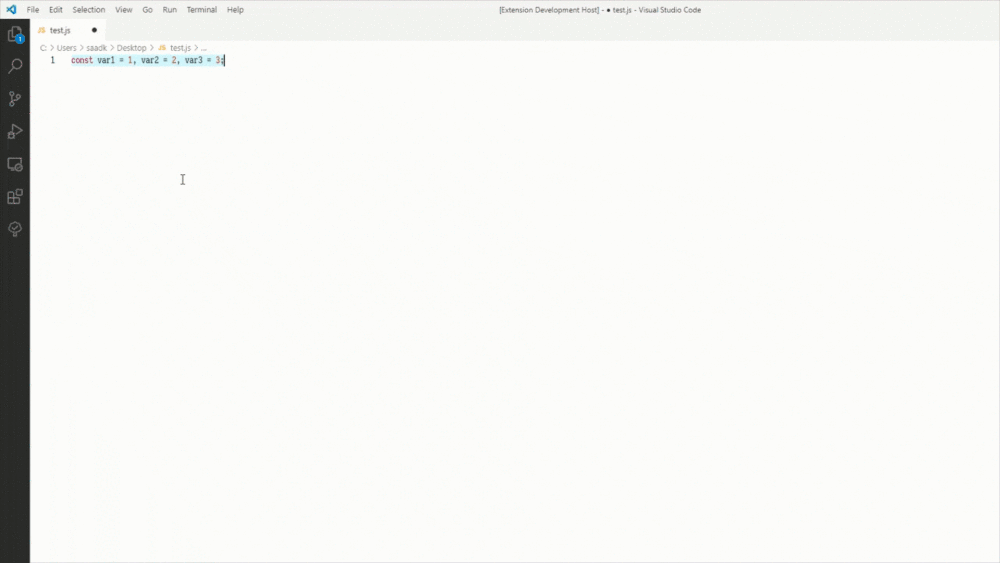

# Single-line, Multi-line

Toggles Selected Text Between Single & Multi-lines.
Meant to convert Arrays, Objects, & Assignments Between Single & Multi-line.

***If selected text has no line breaks:***
Adds Lines Break:
1. Before Or After Comma  `,`
2. After Semicolon  `;`
3. After Opening Brackets  `[ { (`
4. Before & After Closing Brackets  `] } )`

***If selected text has at least one line break:***
Removes All Line Breaks.

*Note:
The code is formatted by calling the format command, which will use your preferred code formatter.*

---

---

### How To Use
 - Open Command Palette with `ctrl + shift + p` & Type `Single-line, Mult-line`
 - To Convert With Commas On Old Line:
	 - Use Hot Key: `ctrl + alt + s` in Windows or `ctrl + cmd + s` in Mac
 - To Convert With Commas On New Line:
	 - Use Hot Key: `ctrl + alt + x` in Windows or `ctrl + cmd + x` in Mac

### Changing Key Bindings
- Open up Your Key Bindings by:
	- Pressing `ctr + k`, `ctrl + s`
	- Pressing `ctrl + shift + p` and type Keyboard Preferences
- Type Singe-line, Multi-line in the search box.
- Assign different keys by:
	- Clicking the pencil icon that shows on hover
	- Right clicking the shortcut and selecting `Change Keybinding`
	- Pressing `Enter` with a command selected
